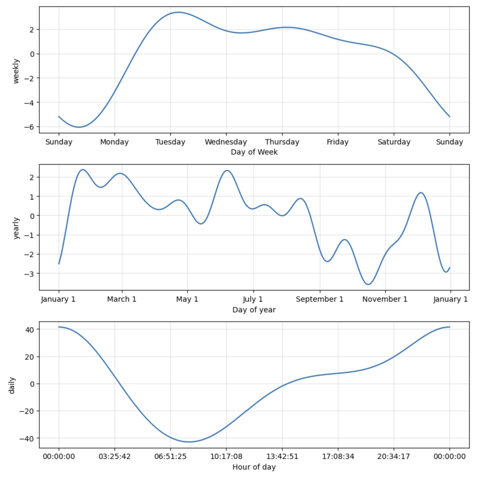
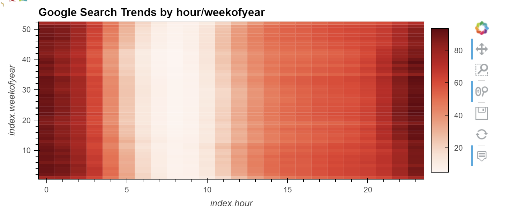
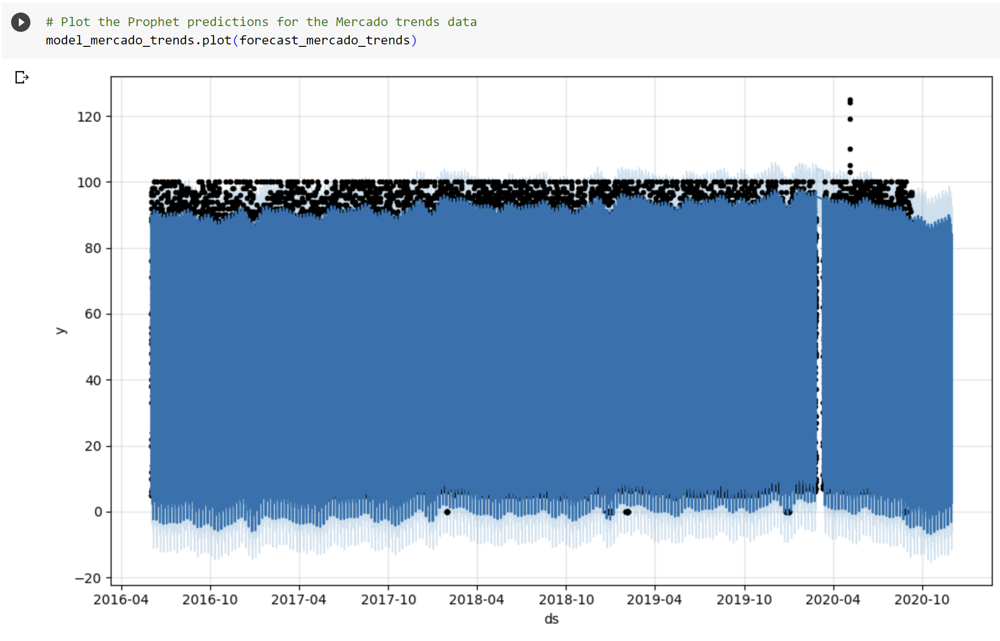
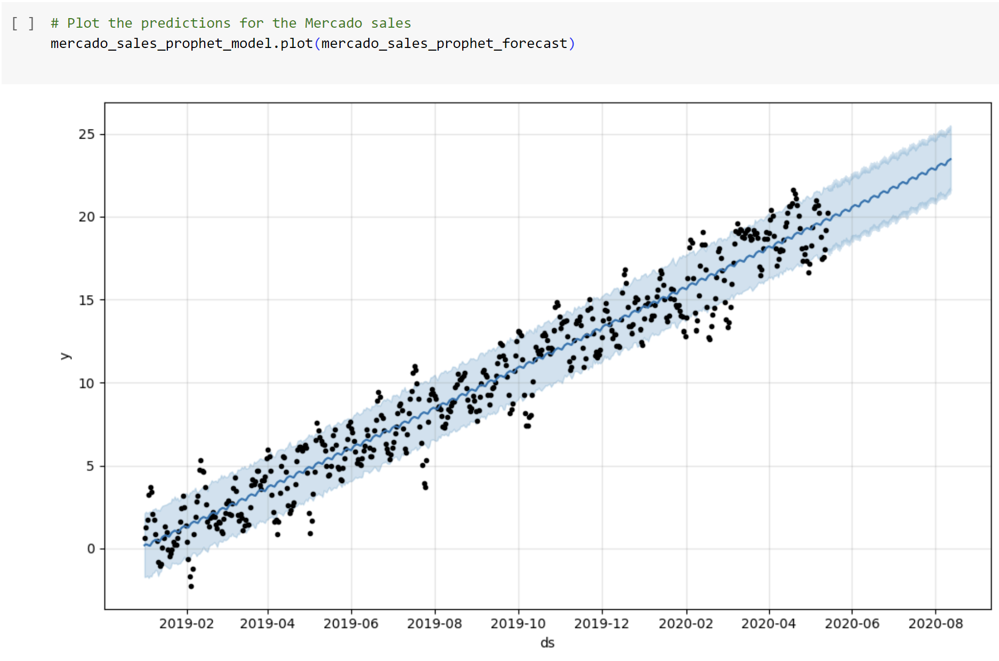
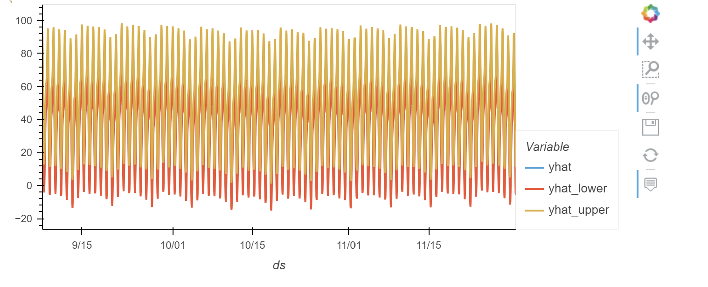

# Time Series Analysis with Prophet

With over 200 million users, MercadoLibre is the most popular e-commerce site in Latin America. This project analyzes the company's financial and user data in an effort to find clever ways to make the company grow. The goal is determine if the ability to predict search traffic can translate into the ability to successfully trade the stock.

This Jupyter notebook contains data preparation, analysis, and visualizations for all the time series data that the company needs to understand in order to try to drive revenue. Specifically, this file contains the following:

- Visual depictions of seasonality (as measured by Google Search traffic) that are of interest to the company.
- An evaluation of how the company’s stock price correlates to its Google Search traffic
- A Prophet forecast model that can predict hourly user search traffic
- A plot of a forecast for the company’s future revenue

## Technologies

Programming Languages: Python 3.7.13

Interactive Development Environment: JupyterLab & Google Colab


Libraries: 
- Pandas - A Python library that is used for data manipulation, analysis, and visualization. 
- Prophet - Prophet is a time series forecasting library developed by Facebook's Core Data Science team. Prophet is built in Python and is widely used for a variety of applications, such as demand forecasting, sales forecasting, and resource planning. 
- Numpy - A popular open-source numerical computing library for Python which provides a powerful array object and a collection of mathematical functions. 
- HvPlot - A Python library that provides a high-level interface for quickly creating interactive plots and visualizations using popular plotting libraries such as Matplotlib, Bokeh, and Plotly.
- Warnings - A Python library that provides a way to handle warning messages that may occur during the execution of a program.

Operating System(s):  Any operating system that supports Python, including Windows & macOS.

## Installation Guide

To run this analysis, make sure you install the necessary dependencies:

1. Install Python: https://www.python.org/downloads/
2. Install and run Jupyter Lab:  https://jupyter.org/install
3. Open and congfigure Google Colab: https://colab.research.google.com/
- The first cell will install the necessary libraries into the Google Colab runtime.
```
!pip install pystan
!pip install prophet
!pip install hvplot
!pip install holoviews
```
- The second cell will import the dependencies for use in the notebook.
```
import pandas as pd
import holoviews as hv
from prophet import Prophet
import hvplot.pandas
import datetime as dt
import numpy as np
%matplotlib inline
import warnings
warnings.filterwarnings('ignore')
```
4. Clone the repository: `git clone "https://github.com/mikenguyenx/11_time_series_prophet_forecast"` using git or download the ZIP file and extract it to a local directory.
5. Alternatively, you can use this Google Colab link to access the jupter lab file:  https://colab.research.google.com/drive/1ENQ73szUyrEpOrdArEvfHEFq4oZ2NYdH#scrollTo=Or4ED4hM3z3z

## Usage

To run the script for the Fund Portfolio Risk Return Analysis:

1. Open a terminal or command prompt and navigate to the directory with the analysis.
2. Launch Google Colab: https://colab.research.google.com/
3. Open `forecasting_net_prophet.ipynb` in Google Colab.
4. Run the code cells by clicking on the run button or by pressing the `Shift + Enter` key combination to load and preprocess the data, and generate visualizations


## Time Series Trends & Models with Prophet

### Forecast Plots


### Heatmap


### Prophet Predictions 


### Prophet Model


### Yhat Plots 


## Contributors

Mike Nguyen


## License

MIT